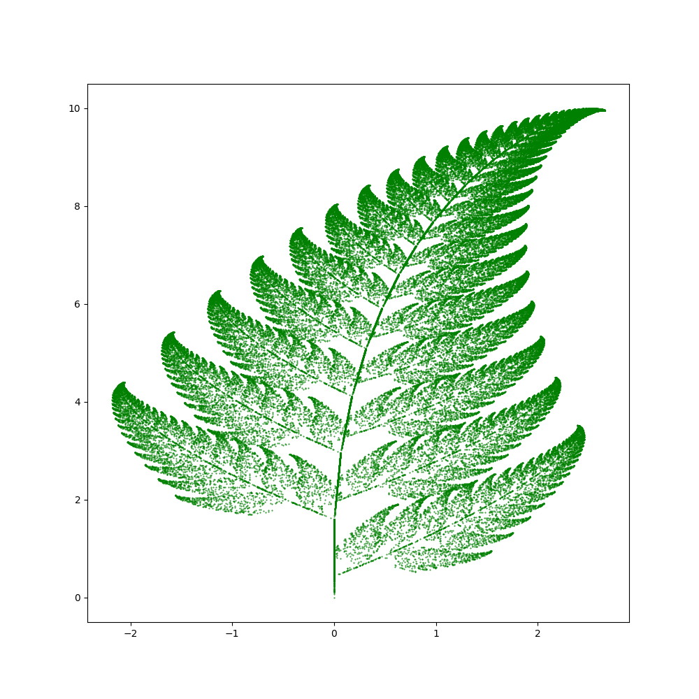
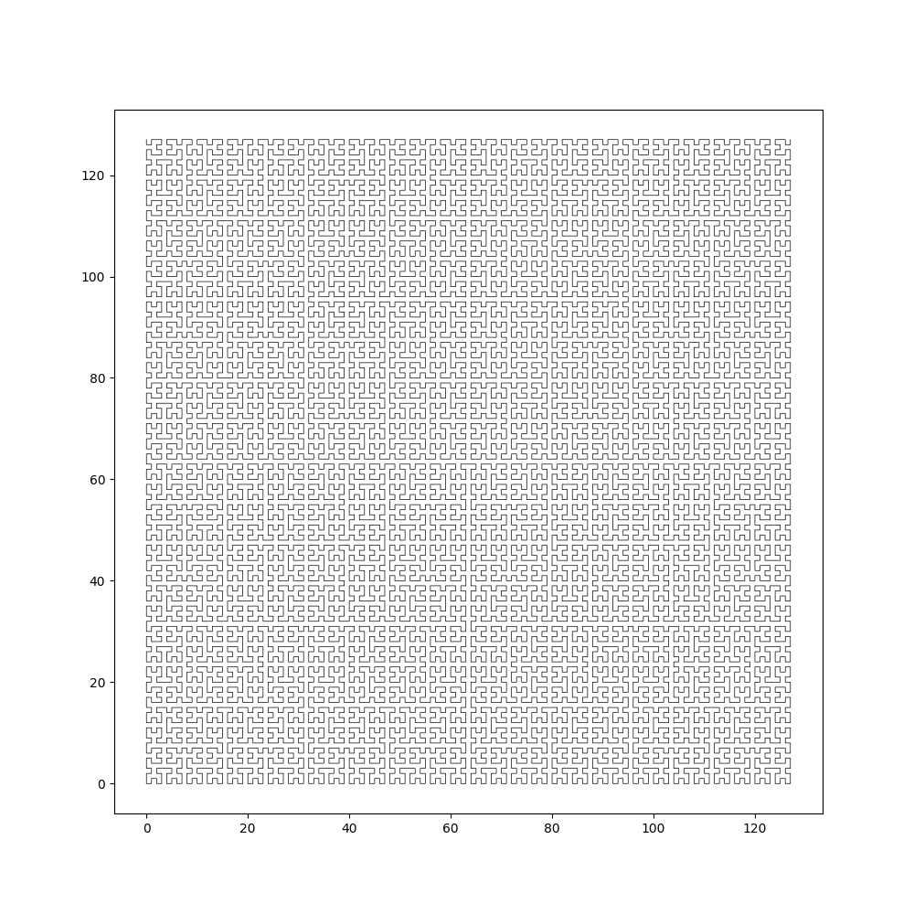
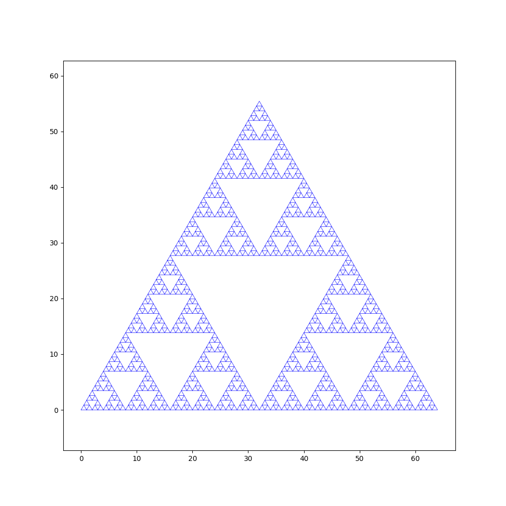
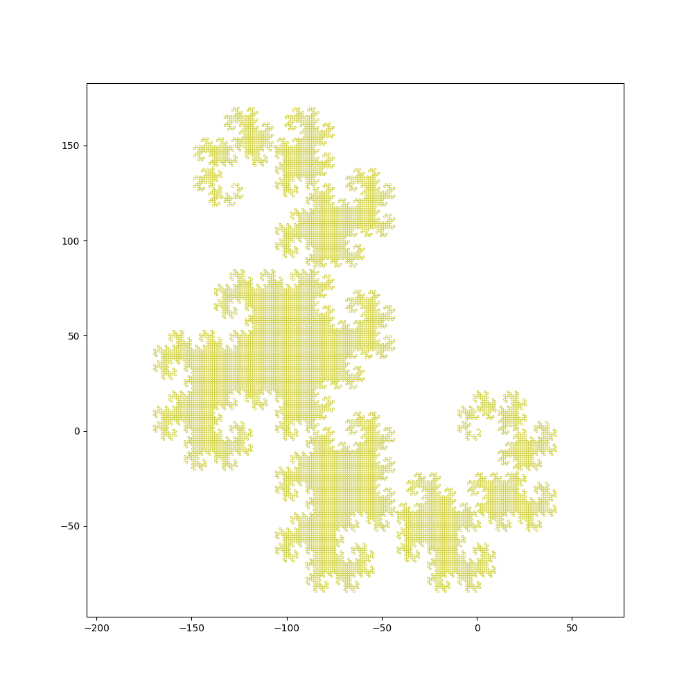

# Plotting fractals

## Introduction

This is a simple program to plot fractals. It is written in Python.
It uses the following libraries:

* [NumPy](http://www.numpy.org/)
* [Matplotlib](http://matplotlib.org/)

## Codes

See [fractals.py](fractals.py) for the implementation.

See [plot.ipynb](plot.ipynb) for examples.

## Examples

- [Barneley's fern](http://en.wikipedia.org/wiki/Barnsley_fern)

- [Hilbert curve](http://en.wikipedia.org/wiki/Hilbert_curve)

- [Siepinski triangle](http://en.wikipedia.org/wiki/Sierpinski_triangle)

- [Dragon curve](http://en.wikipedia.org/wiki/Dragon_curve)

